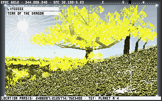
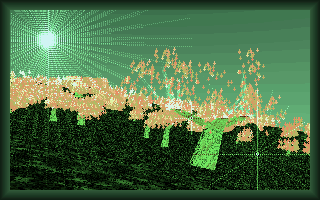
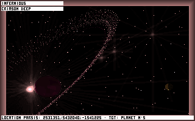
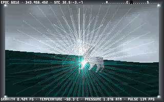

# Noctis++ | A Dreamable Space Simulator, Reimagined
This project is based on [Noctis IV Plus](https://github.com/jorisvddonk/Noctis-IV-Plus) (a basic modification of Alessandro Ghignola's excellent [Noctis IV](https://80.style/#/hsp/noctis_iv/noctis_iv_download_JmsLdos_onlyK) space exploration simulator). It aims to add significant additional features and settings to augment the original gameplay without overtly modifying existing game systems. In addition, it aims to keep backwards-compatibility with the existing GUIDE and other community tools. Old Noctis GUIDE entries should be more-or-less still correct, but it is possible new features may be present, such as new lifeforms exclusive to Noctis++.






## Running Noctis++ On Modern Computers

Noctis was made for MS-DOS and early Windows versions that still supported 16-bit MS-DOS executables natively, and as such, you'll need to be able to run DOS on your computer. To run Noctis++ on modern computers, you have four main options, in order of simplest to most complicated to setup:

1. [DOSBox-X](https://dosbox-x.com/) (all modern operating systems)
2. [DOSBox-Staging](https://www.dosbox-staging.org/) (all modern operating systems)
3. [DOSEMU](http://www.dosemu.org/) (Linux only)
4. A [FreeDOS](https://www.freedos.org/) or MS-DOS environment running inside of a virtual machine like [VirtualBox](https://www.virtualbox.org/) or [Hyper-V](https://en.wikipedia.org/wiki/Hyper-V).

### DOSBox-X (recommended for best performance)

The `Launch.bat` script lets you run Noctis++ with a simple double-click on Windows systems. It expects DOSBox-X to either be installed in it's default location `C:\DOSBox-X\dosbox-x.exe`, or installed portably with it's `bin` folder placed in the main `Noctis-Plus-Plus` folder.

The `Launch.bash` script lets you run Noctis++ with a simple double-click on \*nix systems. It expects DOSBox-x to be installed via `snap`.

If you are using a system other than Windows or Linux, simply run the following command:
```
dosbox-x -c "mount n '<directory where Noctis++ is installed>'" -c "n:" -c "cd modules" -c "NOCTIS.EXE" -conf dosbox.conf -exit
```

### Other DOS Emulators

Run the following commands in your DOS environment:
```batch
cd <directory where Noctis++ is installed>
cd modules
noctis.exe
```

## Compiling

*For a more detailed guide, [click here](source/README.md).*

To compile Noctis++, follow these steps:

1. Get a working MS-DOS setup, as per the above.
2. Install [Borland C++ 3.1 for DOS](https://archive.org/download/bcpp31/BCPP31.ZIP) to `Noctis-Plus-Plus\bc.31`
3. Run the build command:
  - Windows: Double-click `source\Build.bat`.
  - \*nix: Double-click `source\Build.bash`.
